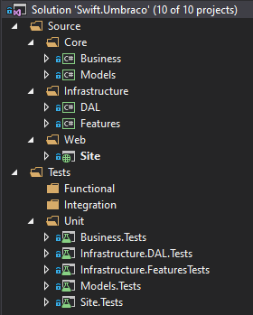

# Swift Umbraco
A template project for starting Umbraco monolith project.

## 1. Author

Nalijaona Irina Andriamifidy  
@sourcewalker

## 2. Structure

This Template is as ASP.NET Framework web project integrating Umbraco CMS 7.14.0 using .NET Framework 4.7.2 structured as following:  

  
*Fig. 1: Swift Umbraco VS Project Structure*

## 3. Achitecture

The architectural overview of the template is resumed as per the following image:

  
*Fig. 2: Swift Umbraco Project Architecture*